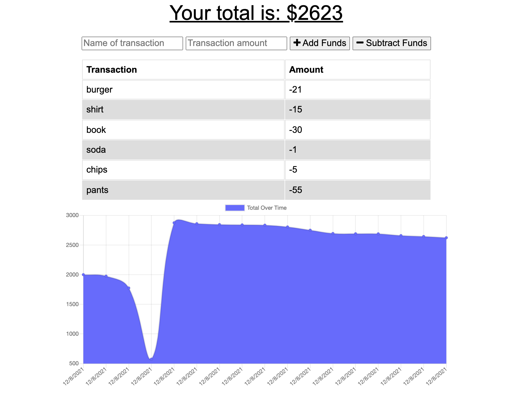

# BudgetTracker

[](https://opensource.org/licenses/MIT)

Link to deployed site on Heroku: https://budget-tracker-app2021.herokuapp.com/

# Description
This Budget Tracker will track transaction for the user with or without an internet connection. If offline, it will add the transactions to the transaction history. The application also displays a chart. Working on this application, was vital to understanding how service workers and manifests work to be able to have progressive web application. This application helped me strength my use of Mongo database, using indexDB, and deploying to Heroku with Atlas. For future applications, I would like to app a calculation and animations.


## Table of Contents

- [Installation](#installation)
- [Usage](#usage)
- [Contributing](#contributing)
- [Tests](#tests)
- [Screenshots](#screenshots)
- [License](#license)
- [Questions](#questions)
- [Acknowledgments](#acknowledgments)

### Installation
After downloading this repository, go into the folder of this project. Then run npm install or i. 

### Usage
Make sure to have MongoDB installed. Then you can use run npm run seed to load the database, then run npm watch to run nodemon or run npm start to just run the server.js if there are no updates expected to be made. You can open Insomnia Core to enter any route create in the /routes/api directory. Using GET,POST,PUT and DELETE functions of Insomnia you can view and update the database. You can also use a program such as ROBO 3T to view the MongoDB collection.

You can also visit the Heroku link above to see the deployed site. Site will track transactions offline and then upload them to transaction history when online.

### Contributing
Feel free to fork or clone this repo and make your own versions.


### Tests
None.


###  Screenshots 
View of Application



###  License

Copyright &copy; 2021 Edgar Ortega

This project is licensed under the terms of the <a href="https://opensource.org/licenses/MIT" target= "_blank" > MIT </a> license.

### Questions

Send questions to edort93@gmail.com or visit <a href="https://github.com/edgarO93" target= "_blank" >my profile </a><br>

### Acknowledgments

```
I would like to thank online resources such as W3 schools, MDN Web Docs, and Stack Overflow.
```